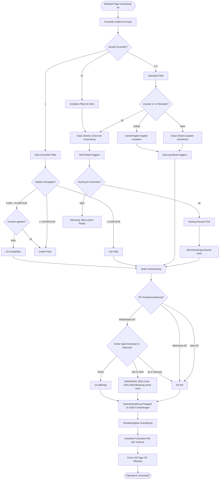
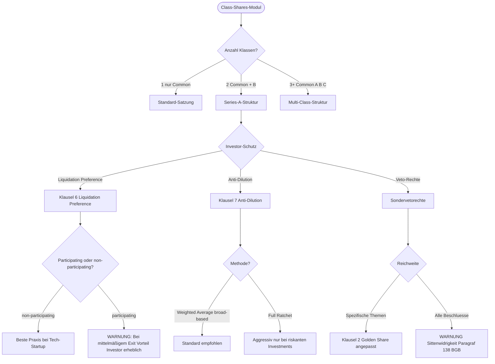
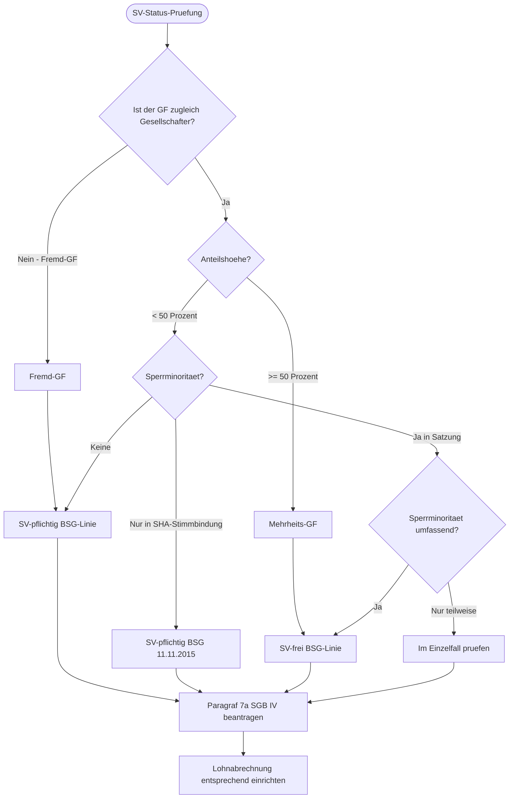
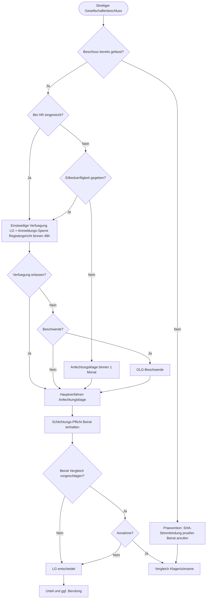

> <div dir="rtl">
>
> **ترجمهٔ فارسی (لایهٔ افزوده) — نسخهٔ آلمانی معتبر و ملاک است.**
> این متن ترجمهٔ ماشینیِ کمکی و صرفاً برای **جهت‌یابی** است، نه ترجمهٔ رسمی و نه مشاورهٔ حقوقی. اصطلاح‌های حقوقی، شمارهٔ مادّه‌ها (مثل «§ 305 BGB»)، نام دادگاه‌ها و شمارهٔ پرونده‌ها **عیناً به آلمانی** نگه داشته شده‌اند؛ بخش‌هایی که مطمئن ترجمه نشده‌اند به آلمانی می‌مانند. **خروجیِ کارِ این اسکیل باید به زبان آلمانی تولید شود.** متن اصلی و معتبر: [`SKILL.md`](./SKILL.md).
>
> </div>

# درخت تصمیم گیری مصرفی

## شروع مستقیم: بخوان، تصمیم بگیر، تحویل بده

با یک فهرست سوال شروع نکنید. اگر مواد موجود باشد، اول آن را بخوانید و از فرضیه کاری قابل استفاده آغاز کنید:

- زمان بندی یا خطر فوری.
- نقش، هدف و وضعیت روش شناسایی شده.
- واقعیت های قابل توجهی از این مواد.
- بهترین قدم بعدی کار با محصول مستقیم است.

به حداکثر دو نکته را بررسی کنید و فقط در صورتی که بدون این پاسخ، گام بعدی اشتباه یا خطرناک باشد. اگر مواد کاملاً از دست رفته باشند، همه اسناد را درخواست نکنید بلکه سه سند اصلی را ذکر کرده باشید و با فرض های قابل مشاهده ادامه دهید.

با یک محصول کاری شروع کنید، نه با فهرست موجودی: یادداشت کوتاه، ورق مهلت، ماتریس آزمون، طرح، لیست پرسش یا پیشنهاد تصمیم گیری. رویتینگ فقط وسیله ای برای هدف است. اگر مهارت خاصی به وضوح مناسب باشد، مستقیماً در این جهت کار می کند.

حالت کار: ابتدا یک فاصله قابل استفاده را در حداکثر هفت جمله ارائه دهید و سپس گام بعدی مشخص. فقط زمانی که زمان، صلاحیت، شواهد، مقدار یا سلسله قانونی دیگر قابل اطمینان نباشد ، سوال کنید. تنها برای تاریخ ها، مدارک، مبالغ، انواع یا اختلافات جدولهاff.

## مسیر کار

- روشن‌کردن نقش، هدف و محصول کاری خواسته‌شده: چه کسی اقدام می‌کند، چه تصمیمی در پیش است، چه مهلتی در جریان است و چه خروجی‌ای لازم است؟
- نخست علامت‌گذاری مهلت‌ها و خطرهای فوری: تنها از مهلت‌های همان حوزهٔ حقوقی مشخص و همان پرونده استفاده کنید؛ اعتراض (Widerspruch)، دعوا (Klage)، ایراد (Einspruch)، طرق شکایت (Rechtsmittel)، مرور زمان (Verjährung)، سقوط حق (Verwirkung) و مهلت‌های ایراد، اعلام، ثبت و انقضا را به‌دقت جدا کنید و هرگز از حوزهٔ تخصصی دیگری برندارید.
- بررسی معیارهای مربوط به: GmbHG در این بخش، به عنوان مثال: BGB ماده 705 ff. ف.ف، HGB ماده 105 ff., AktG/UmwG فقط در صورت اقدام ساختاری و مشخصه های ثبت تجارت/نوتور فرم را به طور زنده بررسی کنید؛ هیچ نمونه ای از دانش نیست.
- تعیین مرجع صالح و انتخاب درست مخاطب: موکل، طرف مقابل، ادارهٔ صالح یا دادگاه، کارشناسان و در صورت لزوم نهاد اتحادیهٔ اروپا/بین‌المللی (به جزئیات اسکیل نگاه کنید).
- گردآوری اسناد و ادلّه و بررسی خلأها: پرونده‌های اداری، اسناد قراردادی، لوایح، تصمیم‌های اداری (Bescheide)، صورت‌جلسه‌ها، نظرهای کارشناسی و ادلّهٔ بیرونیِ همان حوزه — مدارک نبود را از راه دسترسی به پرونده یا پرسش از موکل فراهم کنید، و برای تغییرهای روزِ قوانین و رویهٔ اداری بررسی زنده انجام دهید.

## اصلی تخصص - حقوق اجتماعی و قانون شرکت ها
- **موضوع مشکل این مهارت:** با عنوان مشخصی کنار بیایید `Intake Decision Tree` و سوال تخصصی مطرح شده را حل کند؛ با ویژگی های واقعی، سوالات اثبات و محصول کاری فوری مورد نیاز کار می کند.
- ** رادار استاندارد:** GmbHG در این بخش، به عنوان مثال: ff.; AktG بخش 76، 93 و 113 ، 119 و 130 ff.; HGB ماده 105 ff., 161 ff.; نتایج MoPeG/SERÄndG UmwG; FamFGحقوق ثبت نام GWBکنترل ادغام در معاملات
- **کتاب های قانون:** BGH, 21.04.1997 - II ZR 175/95 برای وظایف سازمان و اطلاعات پایه؛ BGH, 20.11.2018 - II ZR 12/17 برای سوالات فهرست و قانونی، تصمیمات دیگر فقط با منبع آزاد.
- **طریقه کار:** ابتدا شکل شرکت، سازمان، راه تصمیم گیری، نمایندگی، وضعیت ثبت نام، هدف اقتصادی و موقعیت اقلیت را مرتب کنید؛ سپس تعهدات وفاداری، حفظ سرمایه، مسئولیت، بسته شدن معاملات و ریسک اثبات/کمالی بررسی کنید.
- **اجازه های خروجی:** تصمیم/مطابق لیست، ثبت کاری، طرح بورس و مشاوران، فهرست بسته شدن سی پی، لیستی راد فلوتی، یادداشت مسئولیت مدیرعامل یا کاغذی برای تصمیم گیری مشتری.
- **ترمزِ خطا:** قوانین/آرای پایه را زنده یا از خودِ پرونده راستی‌آزمایی کنید؛ رویهٔ قضایی تنها با دادگاه، شکلِ رأی، تاریخ، شمارهٔ پرونده و منبعِ آزادانه قابل‌بررسی. هیچ استنادِ کورِ BeckRS، juris، شرح یا مقاله از دانشِ مدل نیاورید.

## مواد هسته ای

روند دریافت شرکت بنیان گذار اولین مکالمه ساختاری بین مشتری و دفتر است. در این زمان تمام تصمیمات باز کننده هنوز آزاد هستند: شکل قانونی، ساختار سرمایه، رابطه شرکا-مجموعه مالی، ساختار پانلگان، وضعیت بیمه اجتماعی. تغییراتی اشتباه در درآمد - اشکال حقوقی نادرست، عدم وجود اقلیت محدود، ساختار دارویی غیر برنامه ریزی شده - می تواند به بعد تنها با تلاش قابل توجهی و خطرات مالیات اصلاح شود.

این مهارت درخت تصمیم گرافیکی را برای مصرف ساز آماده می کند: منطق مشروط به عنوان نمودار مرموز، اعتبار ساحه واجب ، رویداد های تحریک کننده برای مهارت ها و اسناد، ادغام موتور مهلتها و راهنمایی ماشین کار جریان برای پیاده سازی در Bryter, Josef، Documate یا Node.js/React سفارشی است.

## سوالات شروع سرد

1. **مناظر فرمان:** اولین بار که یک فرمان وجود دارد را دریافت می کنید یا تازه کار می شوید؟
2. ** پروفایل بنیانگذاران:** تعداد بنیان گذاران، اطلاعات هویت موجود؟
3. **سرمایه:** سرمایه گذاری در دسترس؟
4. ** نقشه راه سرمایه گذار:** آیا یک سرمایه گذاری خارجی در 12 تا 24 ماه برنامه ریزی شده است؟
5. ** نقش GF:** آیا یک بنیان گذار باید مدیر عامل شود؟
6. ** اسناد موجود:** آیا یک ورق مهلت، NDA یا LOI وجود دارد؟
7. ** موتور کار جریان:** تصمیم درخت در کدام سیستم عامل اجرا می شود (برایتر، جوزف، دوکومات، Custom) ؟
8. **فورتومات خروجی:** DOCX، PDF، XLSX، iCal/ICS یا JSON؟

## چارچوب حقوقی

### متن های استاندارد و معیارهای اصلی

**پارagraph 7a SGB IV - روش های تعیین وضعیت**
> در این زمینه، باید از طریق یک سازمان یا اداره تحصیلی تصمیم بگیرد که آیا اشتغال وجود دارد.

روش تعیین وضعیت در اداره ی کلیه سازی (DRV Bund) ابزار اصلی برای مشخص کردن واجب التیمی حیثیت یک شرکت کننده GF است. BSG-در ابتدا، نه در نهایت با شروع فعالیت های GF ، قانونی آغاز می شود. SGB IV، مهلت گیری عادی) یا در صورت عدم ثبت نام عمدا تا 30 سال (پرداد 25 Abs. 1 S. 2 SGB IV)

**پرداد 20 GwG - ثبت شفافیت (TraFinG)
> سازمان ها باید مجوزهای اقتصادی را شناسایی کنند، به روز نگه دارند و در این صورت آن را برای شفافیت ثبت نمایند.

مهلت: بلافاصله پس از ثبت شرکت در دفتر تجارت و به طور فوری هر گونه تغییر نسبت سهام (2 هفته) ، مجازات برای نقض: تا 1.000.000 یورو (پرداد 56). GwG).

**پارagraf 192 SGB VII - انجمن های حرفه ای**
> در صورت شروع فعالیت های تجاری، باید یک هفته پس از آن به انجمن حرفه ای مسئول ثبت نام شود.

**پارagraf 138 AO - مالیات و گزارش دادن
> مالیات دهندگان که شغل تجاری یا حرفه ای دارند باید این را به اداره مالی گزارش کنند (سوالنامه ی ELSTER).

**پارagraf 1365 BGB - محدودیت در دسترس بودن مواد
> اگر بنیانگذار در یک جامعه قانونی زندگی می کند، باید تمام دارایی ها را با رضایت همسر خود تصدیق کرد. BGB.

**پرداد 1643 و 1822 BGB - اجازه دادگای خانوادگی برای کودکان
> در مورد شرکت های شریکان کوچک: دادگاه خانوادگی باید موافقت کند که تعهدات حقوقی شرکت را شامل شود.

### آرای راهنما

| دادگاه | نشانه های پرونده | محل یافت | اهمیت |
|---|---|---|---|
| بررسی قانونی زنده | تایید زنده لازم است | - | هیچ تصمیری را از دانش نمونه ای نقل نکند؛ قبل از انتشار، منبع رسمی یا آزاد با دادگاه و تاریخ، اسناد و مدارک ثبت شود. |

## برنامه آزمون: نقاط تعویض

| قدم | نقطه ی اتصال | محتوای بررسی | تگ / خروجی |
|---|---|---|---|
| 1 | گره های داده اصلی | تعداد مؤسس ها؛ هویت (اسم، تاریخ تولد، شماره شناسنامه) ؛ وضعیت خانوادگی (پرداخت 1365 BGB) به عنوان یک کودک (پرداخت 1643 و 1822 BGB) | اعتبار؛ محرک: مجوز دادگاه خانوادگی برای افراد زیر سن |
| 2 | نودها برای انتخاب شکل قانونی | سرمایه در دسترس، برنامه ریزی برای سرمایه گذاری خطر مسئولیت پذیری یا آزادکاری؟ | راه اندازی: انتخاب فرم شركت |
| 3 | گره های سرمایه | < 25،000 یورو → UG؛ 25.000 دلار → GmbH; سرمایه گذاری در مورد پرونده ها → بررسی تفاوت های مالی (پرداد 9 GmbHG) | اعتبارسنجی سرمایه ی مشترک؛ گزارش تاسیس |
| 4 | نوت های کلاس سهام | سرمایه گذار در 12 ماه؟ → سهام کلاس بلافاصله؛ نه → بعد یا مجوز دارالحکومت | راه اندازی: ماژول SHA / ماژولی قانون |
| 5 | ماژول SHA | وستینگ برای بنیانگذاران، انتخاب رای؟ ترجیح نقدی؟ | تگگر: شرکت های بنیان گذار - کلاک کاتالوژی دو زبان |
| 6 | گرهای وضعیت SV | آیا GF 50 درصد سهام دار است؟ | راه حل: روش های تعیین وضعیت SGB IV؛ هشدار در مورد SHA-only |
| 7 | کلاهبرداری | DiRUG آنلاین یا فیزیکی؟ ملاقات شده است؟ اسناد کامل؟ | راه اندازی: تولید بسته های نوتر |
| 8 | گره های دولتی | تجارت، مالیات مالی (ELSTER) ، IHK, BG | تگگر: موتور مهلت؛ تقویم خودکار مقامات |
| 9 | نوت های مطابق | اولین 100 روز واجبات عمومی: بند 315 HGB, بند 325 HGB (اولین افشا) GmbHG (مجموعه ی شرکت ها) ، بند 20 GwG (ترافینگ) | محرک: رعایت اجتماعی |
| 10 | نوت های تناقض | اختلافات بین بنیانگذاران، اعتراض به تصمیم؟ | تحریک کننده: درخواست های شرکت بنیان گذار-شركۀ اختلافات |

## کل ((مرد)



## نمودار دقیق: ماژول سهم کلاس



## نمودار دقیق: بررسی وضعیت SV



## نمودار دقیق: مسیر افزایش اختلافات



## نقاط تعدد مجبوری (کامل)

### شماره 1 - اطلاعات اصلی

**ملتبه های لازم:**
- تعداد بنیانگذاران
- هویت: نام، تاریخ تولد، آدرس و شماره شناسنامه (GwG-آگاهی
- وضعیت خانوادگی (پرداخت 1365) BGB-تحقیق: رضایت همسر در صورت دستگیری کل دارایی)
- کودکان (پرداخت 1643 و 1822 BGB: اجازه دادگاه خانوادگی لازم است)

**حقیقت:**
- شماره شناسنامه، درست در نحوی
- در مورد کودکان: اجازه دادگاه خانوادگی
- GwG-اجب است: اسناد شناسایی (پرداد 10) GwG) وجود دارد؟

### بند 2 - توزیع سهم

**ملتبه های لازم:**
- کل سرمایه گذاری (در EUR)
- سهم های هر مؤسس (در EUR و %)
- تعیین کلاس (عام / A / B / C)

**حقیقت:**
- کل سهم ها = 100 درصد
- حداقل ارتفاع در هر کلاس
- توجه لازم: در مورد نقشه راه سرمایه گذار → سهم کلاس
- تقسیم 50/50 بدون تصمیم گیری → هشدار خطر شکست

### بند 3 - شرکت و IP

**ملتبه های لازم:**
- شرکت آرزو
- محل کار (ممالک فدرال، شهر)
- موضوع تجاری (مستقیم، مناسب برای تصمیم گیری HV)

**حرکات تایید:**
- جستجوی منابع انسانی در سراسر کشور (نقاب نام)
- پیش بینی IHK
- تحقیق در مورد مارک DPMA/EUIPO
- دسترسی به دامنه
- در صورت برخورد: پیشنهادات جایگزین را ارائه دهید

### بند 4 - مدیریت

**ملتبه های لازم:**
- تعداد GF
- شرکای شرکت یا غریبه های خارجی؟
- میزان سهم (در صورت شرکت کنندگان) → بررسی وضعیت SV
- اطلاعات اصلی قرارداد استخدام: دستمزد اولیه، تعرفه ها، تعطیلات، ممنوعیت رقابت

** تگ:**
- بررسی وضعیت SV (نمره 3)
- روش های تعیین وضعیت بخش 7a SGB IV
- تولید قرارداد اشتغال GF

### بند 5 - SHA و Vesting

**شهرهای لازم برای راه اندازی های چندگانه (≥ 2):**
- دوره ی پوشاندن (بعد از 48 ماه)
- کلیف (بعد از 12 ماه)
- تعریف "بدکار" (تازهکاری، نقض واجبتی، عدم رقابت)
- تعریف "خیرکار" (موت، ناتوانی در کار و حذف با توافق)
- تراژ و تاگ (بعد از حد: 75 درصد دراج، 50٪ روز)

** هشدار:**
- عدم استفاده از لباس در شرکت های چند بنیانگذار → خطر خروج
- ضدآزاد شدن Full Ratchet → پرخاشگرانه؛ فقط در مورد سرمایه گذاری های بسیار خطرناک

### بند 6 - شورای مشاوره (اختیاری، توصیه می شود)

- مشاوره بله/نه
- تعداد اعضای (به طور غیر مشخص برای تصمیم گیری)
- قابلیت تعویض (تختیل در مورد واجب اعتدال قبل از شکایت)
- حقوق (عموما: دستمزد ساعت یا سالی)

### بند 7 - نوتر

** تگ:**
- آنلاین یا فیزیکی؟
- رزرو کردن تاریخ نوتر (۲ تا ۴ هفته پیش از موعد)
- تولید لیست اسناد (عقد شرکت، گواهی شخصی، اختیارات در مورد سهامداران خارجی، سند سپرده برای سرمایه گذاری)
- آماده سازی یک جمع آوری سرمایه گذاری (بازرس حساب قبل از ثبت نام؛ اسناد سپرده به عنوان ضمیمه برای ورود HR)

### بند 8 - وظایف مقامات پس از ثبت منابع انسانی

**خودمفعول:**
- درخواست شغلی: بلافاصله (پرداد 14) GewO)
- سوالنامه ی ELSTER: در عرض چهار هفته (پرداخت 138 AO)
- ثبت نام IHK
- یک هفته (پرداد 192) SGB VII)
- گزارش TraFinG (پرداد 20) GwG): بلافاصله پس از ثبت HR

## رویداد های تحریک کننده موتور مهلت

| رویداد | مهلت | اقدام | استاندارد |
|---|---|---|---|
| ثبت منابع انسانی | + حالا | گزارش TraFinG | ماده 20 GwG |
| ثبت منابع انسانی | + یک هفته | ثبت نام BG | ماده 192 SGB VII |
| ثبت منابع انسانی | + 4 هفته | سوالنامه ی ELSTER | ماده 138 AO |
| فعالیت های GF | + حالا | روش های تعیین وضعیت بخش 7a SGB IV | بخش 7 (آ) SGB IV |
| پایان سال های مالی | + 3 ماه | در صورت تهیه ی حساب های سالانه (پرداد 264) Abs. 1 HGB) | ماده 264 HGB |
| در صورت تهیه ی حسابداری | + 9 ماه | افشای عمومی (GmbH) | ماده 325 HGB |
| تصمیم گیری در مورد GV | + یک ماه | زمان تجدید نظر | ماده 246 AktG با هم |
| ایجاد کننده های تشخیص زودرس بحران (پرداخت 102 StaRUG) | + حالا | StaRUG-تحقیق یا ماده 49 Abs. 3 GmbHG-اجتماع شرکت ها | ماده 102 و 49 StaRUG§ 49 Abs. 3 GmbHG |
| در صورت عدم پرداخت (پرداد 17 و 19 InsO) | + 3 هفته | ماده 15 (آ) InsO-ضروحي درخواست | ماده 15 (آ) InsO |
| تغییر شرکت | + بلافاصله (HR) / 2 هفته | فهرست شرکت کنندگان بند 40 GmbHG + گزارش TraFinG § 20 GwG | ماده ۴۰ GmbHG, 20 GwG |

## قوانین اعتبار

### بلوک سخت تایید (blocked state)

| اعتبار | استاندارد | اشتباهات |
|---|---|---|
| سرمایه گذاری اولیه < حداقل (UG: 1 EUR؛ GmbH: 25.000 EUR) | بند 5 Abs. 1، 5 (a) Abs. 1 GmbHG | بلاک: امکان ایجاد نیست |
| کل سهم ≠ 100 درصد | بند 5 GmbHG | بلاک: ساختار سرمایه نامناسب |
| فیلدی که لازم است از بین برود (اسم، تاریخ تولد، آدرس) | ماده 10 GwG§ 7 GmbHG | بلاک: ثبت نام در زمینه منابع انسانی امکان پذیر نیست |
| ورودی بدون اثبات اعتبار | ماده 9 GmbHG | بلاک: گزارش اصلی مورد نیاز |
| کودکان بدون اجازه دادگاه خانوادگی | ماده 1643 و 1822 BGB | بلاک: بازرسی ممنوع |

### وضعیت نرم تایید (حالت هشدار)

| هشدار | دلیل | توصیه |
|---|---|---|
| تقسیم 50/50 بدون تصمیم گیری | خطر شکست در هر رای متنازع | انتخاب با استفاده از مشاوره یا عدم همبستگی عددی |
| وستینگ در چند راه اندازی نبود | حمام بدون محافظت: بنیان گذار می تواند فوراً از آن خارج شود و سهام خود را حفظ کند | شقوط Vesting SHA فوری |
| از حق ارجاع بدون دلیل واقعی محروم | خطر اعتراض (BGH قلی + نمک) | دلیل واقعی را ثبت کنید |
| اقلیت های فدراسیون بدون قصر در قانون اساسی | واجبیت های SV BSG-خط | در قانون اساسی، اقلیت محدود را به دست می آورند؛ تنها تعهد با SHA کافی نیست |
| ممنوعیت رقابت بدون خسارت در وضعیت اقتصادی | ماده 74c HGB مشابه؛ غیر قابل استفاده اگر > 0 یورو بدون کرنس | پرداخت خسارت 50 درصد از حقوق |
| برخورد تجاری شناسایی شد | جستجوی DPMA مثبت | پیشنهاد نام های جایگزین؛ خطر هشدار |

## پیاده سازی موتور کار جریان

### پلتفرم های توصیه شده

| پلتفرم | مناسب بودن | خصوصیت |
|---|---|---|
| برتر (https://bryter.com) | بدون کد قانونی، کار رویه ی حقوقی؛ استاندارد دفتر | برای منطق مشروط پیچیده؛ انتشار اسناد |
| یوسف (https://www.josef.legal) | آتماتاسیون اسناد؛ شرکت های کوچک و متوسط | ساده برای مدیریت اسناد؛ منطق کارافروشی محدود |
| (دقمت)https://www.documate.org) | مجلس حقوق | تمرکز بر تولید اسناد؛ با قالب های DOCX خوب |
| منطق نوتا | کاربری شرکت ها؛ ادارات بزرگ | گران قیمت؛ برای قوانین پیچیده قدرتمند |
| Node.js + JSON قالب + React Hook شکل | حداکثر انعطاف پذیری | توسعه ی 80 تا 200 ساعت |

### معماری

```
┌──────────────────────────────────────────┐
│ Frontend (React Hook Form / Bryter UI) │
│ Kaskadierende Fragen, JSON Schema │
└───────────────────┬──────────────────────┘
 │
┌───────────────────▼──────────────────────┐
│ Business-Logic-Engine │
│ Conditional Logic, Validierung, │
│ Trigger-Events, Fristen │
└───────────────────┬──────────────────────┘
 │
 ┌─────────────┼─────────────┐
 │ │ │
┌─────▼───┐ ┌─────▼────┐ ┌────▼──────┐
│ DOC │ │ Fristen- │ │ Notar- │
│ ASM │ │ Engine │ │ Paket- │
│ DOCX │ │ iCal / │ │ ZIP- │
│ PDF │ │ Outlook │ │ Export │
└─────────┘ └──────────┘ └───────────┘
```

### فرمت های تولید

| شکل | هدف | استاندارد / گیرنده |
|---|---|---|
| DOCX | قانون اساسی، SHA, معاهده GF | وکیل / مدعی برای پردازش |
| PDF | نسخه نهایی پس از بررسی | پرونده ها؛ مقامات |
| XLSX | Cap Table، فهرست مهلت ها, چک لیست مقامات | متقاضی؛ مشاور مالیاتی |
| iCal / ICS | تقویم زمان | Outlook / Apple Calendar؛ حافظه های خودکار |
| JSON | صادرات داده ها | نرم افزار حسابداری؛ CRM |
| زپ | بسته نامه ی نوتر | نهار؛ تمام اسناد فشرده شده |

<!-- BEGIN ausformulierungspflicht (autogen) -->
> **الزامِ تمام‌نویسی و استانداردِ قالب.** محصولِ نهایی در **جمله‌های کامل و تمام‌نوشته** تحویل می‌شود — نه اسکلتِ کلیدواژه، نه تنهٔ خالیِ شرط، نه صرفِ فهرست. شرط‌ها به‌صورتِ جمله‌های تمام‌نوشتهٔ بیان‌گرِ اثرِ حقوقی می‌آیند؛ جای‌گیرها مانند `[Name der Mandantin]` روشن علامت می‌خورند و متنِ پیرامون کامل می‌ماند.
>
> **شکلِ نوشتار:** هرگاه لایحه، قرارداد، یادداشت، تصمیم، ومرک یا هر سندِ نهاییِ دیگر به‌صورتِ DOCX، PDF یا متنِ قالب‌بندی‌شده بیرون داده شود، باید **Times New Roman ۱۱ pt** به‌عنوانِ قلمِ پایه به‌کار رود. عنوان‌ها در همان قلم می‌مانند و تنها می‌توانند سیاه (بولد) یا پلکانی باشند. در خروجیِ صرفاً Markdown یا چت، این خواستهٔ قالب به‌عنوانِ یادداشتِ برون‌سپاری درج می‌شود.
>
> **شماره‌گذاری:** ساختاربندی منحصراً اعشاری (`1`، `1.1`، `1.1.1` و به همین ترتیب). بدون اعداد رومی، بدون ساختاربندی حرفی یا آمیخته.
<!-- END ausformulierungspflicht (autogen) -->

## محتوای نمادین گره JSON

```json
{
 "node_id": "intake_class_shares",
 "title": "Class-Shares-Festlegung",
 "question": "Sollen Anteilsklassen schon bei Gruendung eingefuehrt werden?",
 "type": "single-choice",
 "options": [
 {
 "id": "only_common",
 "label": "Nur Common Shares",
 "next": "intake_vesting",
 "trigger_skill": "gesellschaftsgruender-gesellschaftsvertrag-gmbh",
 "warning_if": [
 {
 "condition": "investor_planned_within_12_months == true",
 "message": "Bei absehbarem Investor empfohlen, schon jetzt Class-Shares oder genehmigtes Kapital für Class B vorzusehen"
 }
 ]
 },
 {
 "id": "common_and_b",
 "label": "Common + Class B (Vorbereitung Investor)",
 "next": "intake_b_share_terms",
 "trigger_skill": "gesellschaftsgruender-share-classes-a-b-c"
 },
 {
 "id": "multi_class",
 "label": "Multi-Class (Common + A + B + C)",
 "next": "intake_multi_class_governance",
 "trigger_skill": "gesellschaftsgruender-share-classes-a-b-c",
 "warning": "Multi-Class-Strukturen sind komplex und teuer beim Notar; nur bei klarer Investoren-Roadmap empfohlen"
 }
 ]
}
```

## گزارش و ردیابی حسابرسی

### مسیر حسابرسی

هر اطلاعات و تصمیم گیری با:
- برچسب زمان (ISO 8601)
- کاربران
- مقدار ورودی
- وضعیت تایید (OK / Warning / Block)
- مهارت های تحریک شده / اسناد

### گزارش خودکار در پایان مصرف

- **آزاد سازی صفحه داده**: تمام اطلاعات اصلی در قالب ساختار یافته
- **Cap Table Initial**: توزیع سهام، کلاس ها و قیمت انتشار
- ** چک لیست وظایف**: با مهلت ها (iCal-export)
- ** لیست توقف شلتی**: چه لازم است وکیل / نوتر / مشاور مالیاتی
- **پاکت Notar**: آماده برای تاریخ notarization (ZIP)
- **تاریخ وظایف مقامات**: به صورت خودکار فایل ICS

## ارزش اختلاف و هزینه

| عنصر جریان کار | توضیحات هزینه |
|---|---|
| مجوز برایت | حدود 500 تا 2000 یورو در ماه بسته به استفاده |
| ترجمه حقوقی (در صورت ارائه اسناد دو زبان) | 500 تا 4،000 یورو به اندازه ای |
| توسعه سفارشی (Node.js + React) | ۸۰ تا ۲۰۰ ساعت × کارگاه توسعه دهنده |
| تاسیس شرکت Notar Gebühren GmbH (سرمایه ی اصلی 25000 یورو) | حدود 700 تا 1500 یورو |
| وکیلی که تمام شرکت های بنیان گذاری را همراهی می کند | حدود 3،000 تا 10 هزار یورو (بعد از شرکت) |

## توصیه استراتژیک

| وضعیت | توصیه |
|---|---|
| راه اندازی با نقشه ی مسیر سرمایه گذار | تمام شرکت های با سهم کلاس، SHA و Vesting؛ آماده سازی بسته به صورت متوازی |
| راه اندازی کنندگان تک نفره بدون برنامه های سرمایه گذاری | کار ساده: انتخاب فرم قانونی + شرکت/کتاب تاسیس / چک لیست مقامات |
| شرکت می خواهد دیجیتالی شود | Bryter یا Josef به عنوان یک ورودی بدون کد؛ توسعه سفارشی برای کنترل حداکثر |
| چند نفر که می توانند اختلاف کنند | تمام SHA با استینگ، Drag/Tag و شقاوت؛ شورای مشاور با وظیفه حل مسئله |

## اسکیل‌های پیوسته

- `gesellschaftsgruender-gruender-intake` - پرسش های مربوط به مصرف
- `gesellschaftsgruender-cap-table` - تولید Cap-table
- `gesellschaftsgruender-klauselkatalog-bilingual` - بند های کامل
- `gesellschaftsgruender-rechtsformwahl` - پیشنهاد شکل حقوقی از داده های دریافت
- `gesellschaftsgruender-gesellschafterstreit-eilantraege` - مسیر تصاعد اختلافات

## منابع و نقل قول

- بخش 7 (آ) SGB IV (نظم تعیین وضعیت)
- ماده 25 SGB IV (مطابق تعویض حقوق: 4 سال / 30 سال)
- ماده 20 GwG (نویس شفافیت؛ دو هفته برای گزارش دادن)
- ماده 192 SGB VII (برنامه گیری مالی یک هفته)
- ماده 138 AO (تغییر مالیاتی)
- ماده 1365, 1643, 1822 BGB (مطالب ازدواج؛ افراد زیر سن)
- ماده 15 (آ) InsO (تضطراب به درخواست ورشکستگی 3 هفته)

به نقل از `../../references/zitierweise.md`.

قانون منبع: هیچ جای برای یافتن نظرات، کتابچه یا مقاله از دانش مدل؛ ادبیات فقط با منابع کاربر و یا زیرنویس زنده مجوزff.
- استفاده از قضیه فقط با دادگاه، تاریخ و نشانه های پرونده ای، شهادت ثابت و منبع آزاد.

## در حال حاضر (حساب)

- استفاده از قضیه فقط با دادگاه، تاریخ و نشانه های پرونده ای، شهادت ثابت و منبع آزاد.

## قالب محصول: خلاصه نتیجه گیری

** آدرس:** مؤکل / دفتر - صدا قابل فهم- توضیح

```
INTAKE-ERGEBNIS — [FIRMA] (geplant)
Datum: [DATUM] | Bearbeiter: [NAME]

EMPFOHLENE RECHTSFORM: [GmbH / UG / GmbH & Co. KG]
Begruendung: [KURZE BEGRUENDUNG AUS DECISION TREE]

GESELLSCHAFTER:
 [NAME 1]: [%] Anteile | Sperrminoritaet: [Ja/Nein] | GF: [Ja/Nein]
 [NAME 2]: [%] Anteile | Sperrminoritaet: [Ja/Nein] | GF: [Ja/Nein]

SV-STATUS GF(s):
 [NAME]: [SV-pflichtig / SV-frei (Mehrheit)] | Statusfeststellung empfohlen: [Ja/Nein]

NAECHSTE SCHRITTE:
 [ ] Firmenname pruefen (IHK-Vorpruefung)
 [ ] Notar-Termin vereinbaren (Vorlauf: 2-4 Wochen)
 [ ] Stammkapital einzahlen (mind. 12.500 EUR)
 [ ] Transparenzregister-Anmeldung (nach HR-Eintragung)
 [ ] Berufsgenossenschaft (1 Woche nach Geschaeftsbeginn)
 [ ] Finanzamt (ELSTER-Fragebogen; Paragraf 138 AO)
 [ ] SV-Statusfeststellung beantragen (DRV Bund)

FRISTEN-EXPORT: [iCal / Outlook generiert: JA / NEIN]
NOTAR-PAKET: [ZIP erstellt: JA / NEIN]
```
