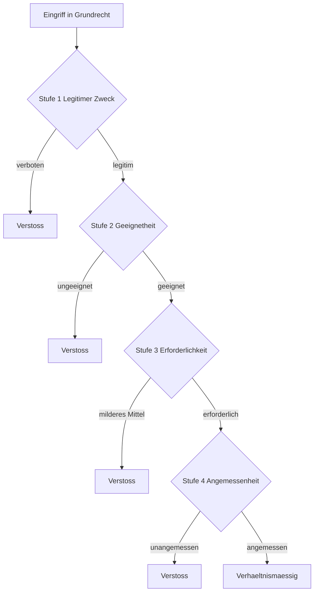
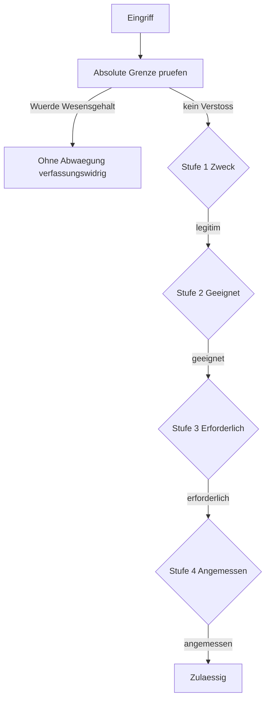
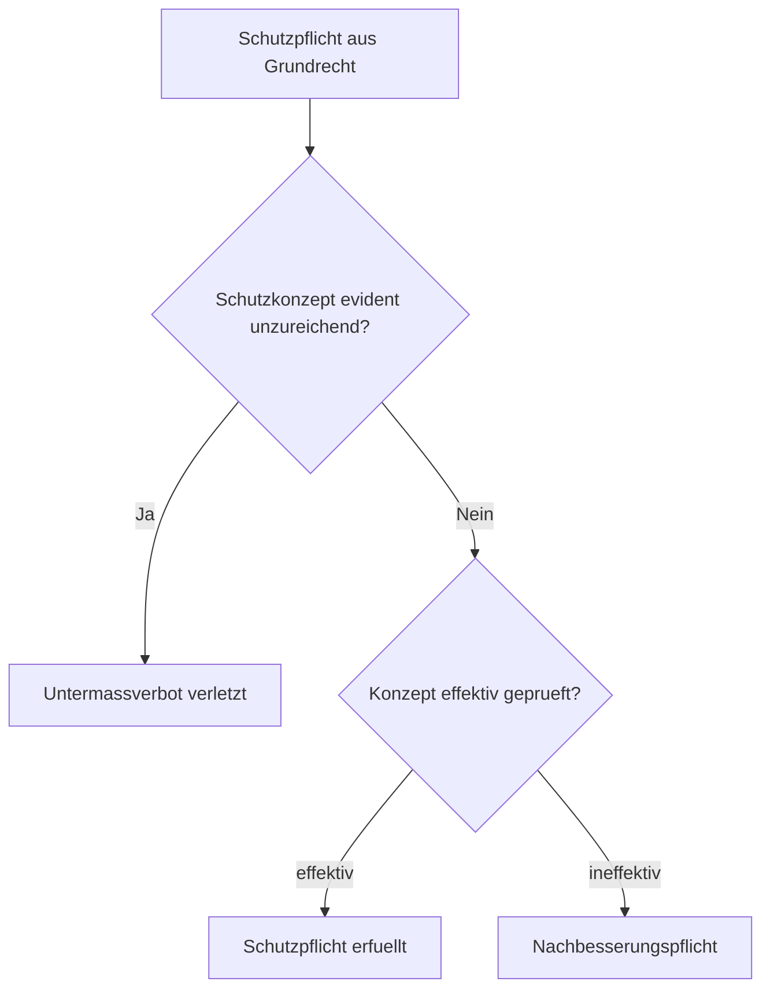

> 

>
> **ترجمهٔ فارسی (لایهٔ افزوده) — نسخهٔ آلمانی معتبر و ملاک است.**
> این متن ترجمهٔ ماشینیِ کمکی و صرفاً برای **جهت‌یابی** است، نه ترجمهٔ رسمی و نه مشاورهٔ حقوقی. اصطلاح‌های حقوقی، شمارهٔ مادّه‌ها (مثل «§ 305 BGB»)، نام دادگاه‌ها و شمارهٔ پرونده‌ها **عیناً به آلمانی** نگه داشته شده‌اند؛ بخش‌هایی که مطمئن ترجمه نشده‌اند به آلمانی می‌مانند. **خروجیِ کارِ این اسکیل باید به زبان آلمانی تولید شود.** متن اصلی و معتبر: [`SKILL.md`](./SKILL.md).
>
> 

# آزمایش طرح جریان مرموز

## خاشق زمینی

## گزینه با محدودیت های مطلق

## متغیر تعهد حفاظت (حظر حداقل)

## نکات استفاده

- در فایل مارک داون بین سه تا بک تیک با شیرخوار قرار گرفته.
- GitHub به طور خودکار Mermaid را در ویکی و نسخه های عادی ارائه می دهد.
- در صورت امتحان، به عنوان یک طرح روی کاغذ قابل تکرار است.
- گره هایی که شماره های موردی برای هر یک از آنها را بررسی می کنند
  در مورد واقعیت.
